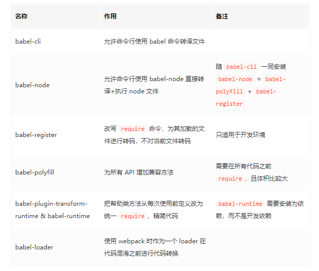

## Babel 的工作流程

上面那幅图已经描述了 Babel 的工作流程，下面我们再详细描述一下。Babel 的三个主要处理步骤分别是： 解析（parse），转换（transform），生成（generate）。

### 解析

将代码解析成抽象语法树（AST），每个 js 引擎（比如 Chrome 浏览器中的 V8 引擎）都有自己的 AST 解析器，而 Babel 是通过 Babylon 实现的。在解析过程中有两个阶段：词法分析和语法分析，词法分析阶段把字符串形式的代码转换为令牌（tokens）流，令牌类似于 AST 中节点；而语法分析阶段则会把一个令牌流转换成 AST 的形式，同时这个阶段会把令牌中的信息转换成 AST 的表述结构。

### 转换

在这个阶段，Babel 接受得到 AST 并通过 babel-traverse 对其进行深度优先遍历，在此过程中对节点进行添加、更新及移除操作。这部分也是 Babel 插件介入工作的部分。

### 生成

将经过转换的 AST 通过 babel-generator 再转换成 js 代码，过程就是深度优先遍历整个 AST，然后构建可以表示转换后代码的字符串。

而值得注意的是，babel 的插件有两种，一种是语法插件，这类插件是在解析阶段辅助解析器（Babylon）工作；另一类插件是转译插件，这类插件是在转换阶段参与进行代码的转译工作，这也是我们使用 babel 最常见也最本质的需求。

## Babel 工具

### babel-cli

顾名思义，cli 就是命令行工具。安装了 babel-cli 就能够在命令行中使用 babel 命令来编译文件。

### babel-node

它的作用是在 node 环境中，直接运行 es2015 的代码，而不需要额外进行转码。

### babel-loader

但一些大型的项目都会有构建工具 (如 webpack 或 rollup) 来进行代码构建和压缩 (uglify)。理论上来说，我们也可以对压缩后的代码进行 babel 处理，但那会非常慢。因此如果在 uglify 之前就加入 babel 处理，岂不完美？
所以就有了 babel 插入到构建工具内部这样的需求。以(我还算熟悉的) webpack 为例，webpack 有 loader 的概念，因此就出现了 babel-loader。
和 babel-cli 一样，babel-loader 也会读取 .babelrc 或者 package.json 中的 babel 段作为自己的配置，之后的内核处理也是相同。唯一比 babel-cli 复杂的是，它需要和 webpack 交互，因此需要在 webpack 这边进行配置。

### babel-register

babel-register 模块改写 require 命令，为它加上一个钩子。此后，每当使用 require 加载 .js、.jsx、.es 和 .es6 后缀名的文件，就会先用 babel 进行转码。

### babel-polyfill

babel 默认只转换 js 语法，而不转换新的 API，比如 Iterator、Generator、Set、Maps、Proxy、Reflect、Symbol、Promise 等全局对象，以及一些定义在全局对象上的方法(比如 Object.assign)都不会转码。需要使用 babel-polyfill 添加垫片加上这些方法

babel-plugin-transform-runtime 会由工具自动添加，主要的功能是为 api 提供沙箱的垫片方案，不会污染全局的 api，因此适合用在第三方的开发产品中。



## preset

插件集合
preset 分为以下几种：
官方内容，目前包括 env, react, flow, minify 等。这里最重要的是 env

### env

env 的核心目的是通过配置得知目标环境的特点，然后只做必要的转换。例如目标浏览器支持 es2015，那么 es2015 这个 preset 其实是不需要的，于是代码就可以小一点(一般转化后的代码总是更长)，构建时间也可以缩短一些。


### 执行顺序

很简单的几条原则：
- Plugin 会运行在 Preset 之前。
- Plugin 会从前到后顺序执行。
- Preset 的顺序则 刚好相反(从后向前)。

### 插件和 preset 的配置项

```
"presets": [
    // 带了配置项，自己变成数组
    [
        // 第一个元素依然是名字
        "env",
        // 第二个元素是对象，列出配置项
        {
          "module": false
        }
    ],

    // 不带配置项，直接列出名字
    "stage-2"
]

```

