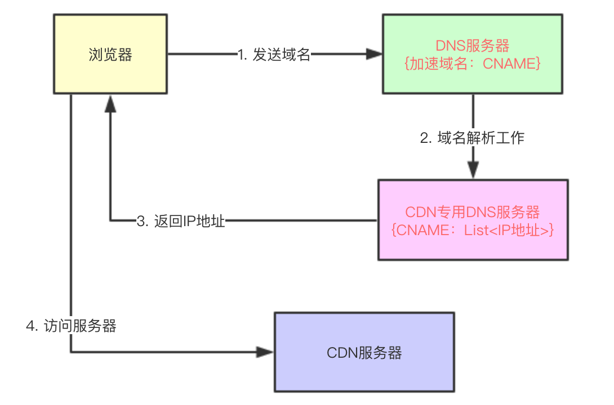

## CDN

CDN全称叫做“Content Delivery Network”，中文叫内容分发网络。
即内容分发网络，它能够实时地根据网络流量和各节点的连接、负载状况以及到用户的距离和响应时间等综合信息将用户的请求重新导向离用户最近的服务节点上。其目的是使用户可就近取得所需内容，解决 Internet网络拥挤的状况，提高用户访问网站的响应速度。

感觉相当于把资源缓存到了距离用户较近的节点

## 如何做到解析出来一个离用户最近的一个IP地址呢。

### 基于CNAME域名解析
解析域名分为两种：
- 将一个域名解析为一个IP地址
- 将一个域名解析为另外一个域名

而域名解析是由DNS系统来负责的，DNS服务接受外部请求，从请求里提取域名，
- 如果这个域名对应的是IP地址，则返回这个IP地址，
- 如果这个域名对应的是CNAME，则继续查找CNAME域名的IP地址，然后将该地址返回给请求发送者。

### 特殊的DNS服务器-CDN专用DNS服务器
普通的DNS系统是做不到的，需要一个特殊的DNS服务器，这个特殊DNS需要知道
- 用户当前所在位置
- 还需要知道用户现在访问的这个域名对应哪些IP地址，以及这个IP地址分别在哪?

第一个问题好解决，直接从用户请求里提取出用户的ip地址，比如这个ip地址被解析为北京电信、上海移动等等

第二个问题由CDN提供商解决，他们肯定知道他们公司在哪些地方部署了机器以及它们的IP地址，所以这个问题只能有CDN提供商来解决，CDN提供商会提供这个特殊的DNS服务器，我们叫做 CDN专用DNS服务器。

这样的话，只要用户在使用某个域名访问静态资源时，如果用户直接配置自己电脑的DNS地址为CDN专用DNS服务器。我们不能要求世界上所有的用户都去修改自己电脑的DNS地址。所以这个时候就要利用DNS中的CNAME了。

用户使用某个域名来访问静态资源时（这个域名在阿里CDN服务中叫做“加速域名”），比如这个域名为“image.baidu.com”，它对应一个CNAME，叫做“cdn.ali.com”，那么普通DNS服务器（区别CDN专用DNS服务器）在解析“image.baidu.com”时，会先解析成“cdn.ali.com”，普通DNS服务器发现该域名对应的也是一个DNS服务器，那么会将域名解析工作转交给该DNS服务器，该DNS服务器就是CDN专用DNS服务器。

CDN专用DNS服务器对“cdn.ali.com”进行解析，然后依据服务器上记录的所有CDN服务器地址信息，选出一个离用户最近的一个CDN服务器地址，并返回给用户，用户即可访问离自己最近的一台CDN服务器了。

## CDN的优点

### 提高页面加载速度

用户访问距离自己最近的机器，速度肯定是最快的。

### 分布式部署-增加内容的冗余、提高容错率

CDN是一个典型的分布式架构，它通过增加数据的冗余，一方面保障在大流量面前有多台服务器能够提供相同的数据；另一方面当部分机器出现故障时，可以进行自动转移。转向一个正常运行的服务器

### 负载均衡系统

两级调度体系分为全局负载均衡（GSLB）和本 地负载均衡（SLB）。GSLB主要根据用户就近性原则，通过对每个服务节点进行“最优”判断，确定向用户提供服务的cache的物理位置。SLB主要负 责节点内部的设备负载均衡

### 保障服务安全

CDN可防止的攻击：DDOS攻击，该攻击就是通过巨大流量打满你的带宽，让你丧失服务能力。那么由于CDN的存在，它将巨大的流量进行了分流。那么源站压力自然小了。这其实也是高并发需要考虑的。

### 节省带宽

带宽优化，分担网络流量，减轻压力，

### 本地Cache加速，加快访问速度

## 为什么百兆带宽还是需要CDN

- 传输时延是指一个站点从开始发送数据帧到数据帧发送完毕所需要的全部时间
- 传播时延是指发送端开始发送数据到接收端收到数据所需要的全部时间。
- 传输时延和发送数据帧大小有关，而传播时延和传输距离相关。
- 可将比特流类比成一列（好几个）汽车，他们通过收费站所需要的时间，类似于传输时延（决定于收费员收一个汽车费用的时间，而与这条公路有多长无关）；他们沿着公路到达目的地的时间类似传播时延，与公路长度有关
  
网络传输过程中有传输时延和传播时延，距离越远，传播时延越高，提高带宽只是减少了传输时延，而对于那些较远距离的访问，那么这个问题的根本原因是网络传输是依赖于网线的，网线越长，那么时间肯定就越久。比如从北京到上海依然还是需要一定的时间，但是你在全国都有CDN服务器的话，上海就可以就近从上海的CDN取到内容了。

如果不用CDN，因为一次http最起码三次握手四次挥手。7个来回的链接，距离的时延是指数增长的