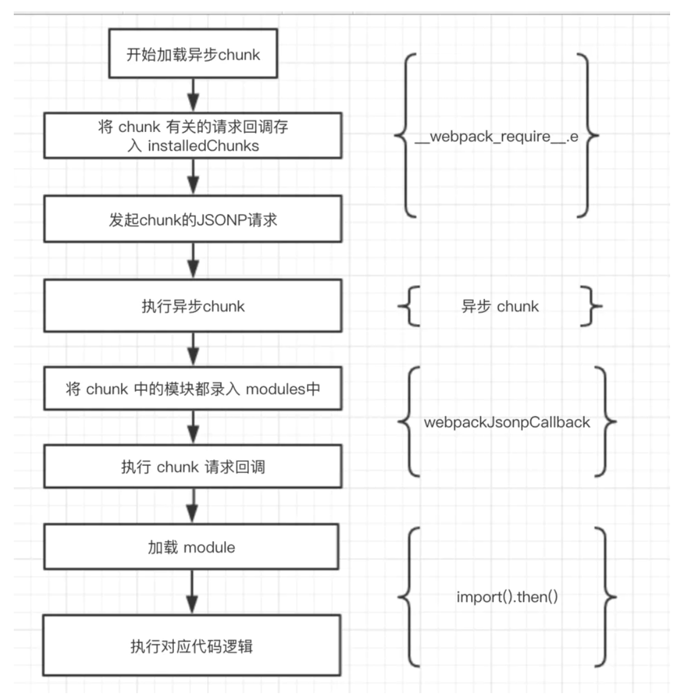

## Webpack 打包原理
>it internally builds a dependency graph which maps every module your project needs and generates one or more bundles（webpack会在内部构建一个 依赖图(dependency graph)，此依赖图会映射项目所需的每个模块，并生成一个或多个 bundle）

- 我们需要读到入口文件里的内容（也就是index.js的内容）
- 利用babel完成代码转换及解析,并生成单个文件的依赖模块Map
- 分析入口文件，递归的去读取模块所依赖的文件内容，生成依赖图
- 将各个引用模块打包为一个立即执行函数
- 根据依赖图，生成浏览器能够运行的最终代码
- 将最终的bundle文件写入bundle.js中

## tapable 钩子
>参考https://juejin.im/post/5aa3d2056fb9a028c36868aa

webpack本质上是一种事件流的机制，它的工作流程就是将各个插件串联起来，而实现这一切的核心就是Tapable，webpack中最核心的负责编译的Compiler和负责创建bundles的Compilation都是Tapable的实例。

（1）多个事件连续顺序执行
（2）并行执行
（3）异步执行
（4）一个接一个地执行插件，前面的输出是后一个插件的输入的瀑布流执行顺序
（5）在允许时停止执行插件，即某个插件返回了一个undefined的值，即退出执行
我们可以看到，Tapable就像nodejs中EventEmitter,提供对事件的注册on和触发emit,理解它很重要


## Compiler 和 Compilation
>https://segmentfault.com/a/1190000015088834?utm_source=tag-newest

在开发 Plugin 时最常用的两个对象就是 Compiler 和 Compilation，它们是 Plugin 和 Webpack 之间的桥梁。 Compiler 和 Compilation 的含义如下：

Compiler 对象包含了 Webpack 环境所有的的配置信息，包含 options，loaders，plugins 这些信息，这个对象在 Webpack 启动时候被实例化，它是全局唯一的，可以简单地把它理解为 Webpack 实例；
Compilation 对象包含了当前的模块资源、编译生成资源、变化的文件等。当 Webpack 以开发模式运行时，每当检测到一个文件变化，一次新的 Compilation 将被创建。Compilation 对象也提供了很多事件回调供插件做扩展。通过 Compilation 也能读取到 Compiler 对象。
Compiler 和 Compilation 的区别在于：Compiler 代表了整个 Webpack 从启动到关闭的生命周期，而 Compilation 只是代表了一次新的编译。

webpack 的入口文件其实就实例了Compiler并调用了run方法开启了编译，webpack的编译都按照下面的钩子调用顺序执行。

before-run 清除缓存
run 注册缓存数据钩子
before-compile
compile 开始编译
make 从入口分析依赖以及间接依赖模块，创建模块对象
build-module 模块构建
seal 构建结果封装， 不可再更改
after-compile 完成构建，缓存数据
emit 输出到dist目录

## Webpack构建流程

- 初始化参数：从配置文件和 Shell 语句中读取与合并参数,得出最终的参数。
- 开始编译：用上一步得到的参数初始化 Compiler 对象,加载所有配置的插件,执行对象的 run 方法开始执行编译。
- 确定入口：根据配置中的 entry 找出所有的入口文件。
- 编译模块：从入口文件出发,调用所有配置的 Loader 对模块进行翻译,再找出该模块依赖的模块,再递归本步骤直到所有入口依赖的文件都经过了本步骤的处理。
- 完成模块编译：在经过第 4 步使用 Loader 翻译完所有模块后,得到了每个模块被翻译后的最终内容以及它们之间的依赖关系。
- 输出资源：根据入口和模块之间的依赖关系,组装成一个个包含多个模块的 Chunk,再把每个 Chunk 转换成一个单独的文件加入到输出列表,这步是可以修改输出内容的最后机会。
- 输出完成：在确定好输出内容后,根据配置确定输出的路径和文件名,把文件内容写入到文件系统。

简单总结：
- 读取文件分析模块依赖
- 对模块进行解析执行(深度遍历)
- 针对不同的模块使用相应的loader
- 编译模块，生成抽象语法树AST。
- 循环遍历AST树，拼接输出js。

## module和plugins有什么区别

module里面是放的loader ，用于对模块源码的转换，loader描述了webpack如何处理非javascript模块，并且在buld中引入这些依赖。loader可以将文件从不同的语言（如TypeScript）转换为JavaScript，或者将内联图像转换为data URL。比如说：CSS-Loader，Style-Loader等。

plugin 用于扩展webpack的功能。它直接作用于 webpack，扩展了它的功能。目的在于解决loader无法实现的其他事，从打包优化和压缩，到重新定义环境变量，功能强大到可以用来处理各种各样的任务。

## alias对文件路径优化

extension: 指定extension之后可以不用在require或是import的时候加文件扩展名,会依次尝试添加扩展名进行匹配
alias: 配置别名可以加快webpack查找模块的速度

```
resolve: {
    extension: ["", ".js", ".jsx"],
    alias: {
      "@": path.join(__dirname, "src"),// @就代表src这个地址
      pages: path.join(__dirname, "src/pages"),
      router: path.join(__dirname, "src/router")
    }
  },

```

## noParse（无需解析内部依赖的包）

```

module：{
    noParse：/jquery/
}
```

## 为什么需要hash

为了解决浏览器文件缓存问题，例如：代码更新后，文件名称未改变，浏览器非强制刷新后，浏览器去请求文件时认为文件名称未改变而直接从缓存中读取不去重新请求。我们可以在webpack.prod.js输出文件名称中添加hash值.

## babel-polyfill的作用

Babel默认只转换新的JavaScript句法（syntax），而不转换新的API，比如Iterator、Generator、Set、Maps、Proxy、Reflect、Symbol、Promise等全局对象，以及一些定义在全局对象上的方法（比如Object.assign）都不会转码。

举例来说，ES6在Array对象上新增了Array.from方法。Babel就不会转码这个方法。如果想让这个方法运行，必须使用babel-polyfill，为当前环境提供一个垫片。

polyfill指的是“用于实现浏览器不支持原生功能的代码”，比如，现代浏览器应该支持fetch函数，对于不支持的浏览器，网页中引入对应fetch的polyfill后，这个polyfill就给全局的window对象上增加一个fetch函数，让这个网页中的JavaScript可以直接使用fetch函数了，就好像浏览器本来就支持fetch一样。在这个链接上 https://github.com/github/fetch 可以找到fetch polyfill的一个实现。

presets的"@babel/preset-env"里可以设置useBuiltIns来动态载入polyfill(需要事先在html里嵌入CDN)，不用在js里全局引入babel-polyfill


## css编译器顺序导致了Webpack编译报错

### 错误实例

下面写法看似逻辑是对的，其实在报错，因为编译器的执行不是css-loader->style-loader->
```
module: {
    rules: [
      {
        test: /\.less$/,
        use: [
          'css-loader',// css-loader加载器去解析这个文件，遇到“@import”等语句就将相应样式文件引入
          'style-loader',// 最后计算完的css，将会使用style-loader生成一个内容为最终解析完的css代码的style标签，放到head标签里
         	...
        ]
      },
    ]
  }
```

### 了解Webpack编译器顺序
其实为啥是从右往左，而不从左往右，只是Webpack选择了compose方式，而不是pipe的方式而已，在技术上实现从左往右也不会有难度

在Uninx有pipeline的概念，平时应该也有接触，比如 ps aux | grep node，这些都是从左往右的。

但是在函数式编程中有组合的概念，我们数学中常见的f(g(x))，在函数式编程一般的实现方式是从右往左，如
```
const compose = (...fns) => x => fns.reduceRight((v, f) => f(v), x);
const add1 = n => n + 1; //加1
const double = n => n * 2; // 乘2
const add1ThenDouble = compose(
  double,
  add1
);
add1ThenDouble(2); // 6
// ((2 + 1 = 3) * 2 = 6) 
```
这里可以看到我们先执行的加1，然后执行的double，在compose中是采用reduceRight，所以我们传入参数的顺序编程了先传入double，后传入add1

那么其实也可以实现从左往右
```
const pipe = (...fns) => x => fns.reduce((v, f) => f(v), x);
const add1ThenDouble = pipe(
  add1,
  double
);
add1ThenDouble(2); // 6
// ((2 + 1 = 3) * 2 = 6)
```
所以只不过webpack选择了函数式编程的方式，所以loader的顺序编程了从右往左

### 完整的配置
```
      {
        test: /\.less$/,
        use: [
          'style-loader',
          'css-loader',
          'postcss-loader',
          'less-loader'
        ]
      },
```

## Es6 import() 动态加载

在代码中所有被import()的模块，都将打成一个单独的包，放在chunk存储的目录下。在浏览器运行到这一行代码时，就会自动请求这个资源，实现异步加载。
webpack4已经支持了Es6的动态加载，无需再做配置



参考https://juejin.cn/post/6844903888319954952

## Tree-shaking的原理

Tree-shaking的本质是消除无用的js代码（像摇树木的枯叶一样）。无用代码消除在广泛存在于传统的编程语言编译器中，编译器可以判断出某些代码根本不影响输出，然后消除这些代码，这个称之为DCE（dead code elimination）。

Tree-shaking 和传统的 DCE的方法又不太一样，传统的DCE 消灭不可能执行的代码，而Tree-shaking 更关注宇消除没有用到的代码，消除那些引用了但并没有被使用的模块。

Tree-shaking的原理是通过ES Module的方式进行静态分析，同时对程序流进行分析，判断变量是否被使用。ES6模块依赖关系是确定的，和运行时的状态无关，可以进行可靠的静态分析，这就是tree-shaking的基础。


## 什么是CDN

CDN的全称是Content Delivery Network，即内容分发网络。
其基本思路是尽可能避开互联网上有可能影响数据传输速度和稳定性的瓶颈和环节，使内容传输的更快、更稳定。通过在网络各处放置节点服务器所构成的在现有的互联网基础之上的一层智能虚拟网络，CDN系统能够实时地根据网络流量和各节点的连接、负载状况以及到用户的距离和响应时间等综合信息将用户的请求重新导向离用户最近的服务节点上。
其目的是使用户可就近取得所需内容，解决Internet网络拥挤的状况，提高用户访问网站的响应速度。


## CDN关键技术

- 内容发布：它借助于建立索引、缓存、流分裂、组播（Multicast）等技术，将内容发布或投递到距离用户最近的远程服务点（POP）处；
- 内容路由：它是整体性的网络负载均衡技术，通过内容路由器中的重定向（DNS）机制，在多个远程 POP 上均衡用户的请求，以使用户请求得到最近内容源的响应；
- 内容交换：它根据内容的可用性、服务器的可用性以及用户的背景，在POP的缓存服务器上，利用应用层交换、流分裂、重定向（ICP、WCCP）等技术，智能地平衡负载流量；
- 性能管理：它通过内部和外部监控系统，获取网络部件的状况信息，测量内容发布的端到端性能（如包丢失、延时、平均带宽、启动时间、帧速率等），保证网络处于最佳的运行状态。

## 用 Webpack 实现 CDN 的接入

构建需要实现以下几点：
静态资源的导入 URL 需要变成指向 CDN 服务的绝对路径的 URL 而不是相对于 HTML 文件的 URL。
静态资源的文件名称需要带上有文件内容算出来的 Hash 值，以防止被缓存。
不同类型的资源放到不同域名的 CDN 服务上去，以防止资源的并行加载被阻塞。

使用公共cdn。webpack中可以利用externals属性，将不希望打包的第三方公共库独立出来在html中全局引入，这样的优势在于加快了编译打包的速度，更重要的是减小了打包后文件的大小，可以利用公共cdn引入第三方库。

```
externals: {
    'jquery': 'jQuery',
    'react': 'React',
    'react-dom': 'ReactDOM',
    'antd': 'antd'
  },
```

然后在模板中加上链接
```
<!DOCTYPE html>
<html>
  <head>
    <meta charset="utf-8">
    <meta name="viewport" content="width=device-width,initial-scale=1.0">
    <title><%= htmlWebpackPlugin.options.title %></title>
    <link href="https://cdn.bootcss.com/antd/4.0.0-rc.4/antd.css" rel="stylesheet">
  </head>
  <body>
    <div id="app"></div>
    <!-- 正常的引入 cdn 资源即可 -->
    <script src="https://cdn.bootcss.com/react/16.12.0/cjs/react.production.min.js"></script>
    <script src="https://cdn.bootcss.com/react-dom/16.12.0/cjs/react-dom.production.min.js"></script>
    <script src="https://cdn.bootcss.com/jquery/3.3.1/jquery.min.js"></script>
    <script src="https://cdn.bootcss.com/antd/4.0.0-rc.4/antd-with-locales.min.js"></script>
    <!-- built files will be auto injected -->
  </body>
</html>
```

## 首屏渲染loading
使用 html-webpack-plugin 来帮助我们自动插入 loading
```
var HtmlWebpackPlugin = require('html-webpack-plugin');
var path = require('path');

// 读取写好的 loading 态的 html 和 css
var loading = {
    html: fs.readFileSync(path.join(__dirname, './loading.html')),
    css: '<style>' + fs.readFileSync(path.join(__dirname, './loading.css')) + '</style>'
}

var webpackConfig = {
  entry: 'index.js',
  output: {
    path: path.resolve(__dirname, './dist'),
    filename: 'index_bundle.js'
  },
  plugins: [
    new HtmlWebpackPlugin({
      filename: 'xxxx.html',
      template: 'template.html',
      loading: loading
    })
  ]
};

```

模板中：
```
<!DOCTYPE html>
<html lang="en">
    <head>
        <%= htmlWebpackPlugin.options.loading.css %>
    </head>

    <body>
        <div id="root">
            <%= htmlWebpackPlugin.options.loading.html %>
        </div>
    </body>
</html>

```

## optimization.splitChunks 拆分模块

- chunks: 表示哪些代码需要优化，有三个可选值：initial(初始块,范围排除动态加载的模块，不会单独抽离动态加载模块)、async(按需加载块)、all(全部块)，默认为async
- minSize: 表示在压缩前的最小模块大小，默认为30000
- minChunks: 表示被引用次数，默认为1
- maxAsyncRequests: 按需加载时候最大的并行请求数，默认为5
- maxInitialRequests: 一个入口最大的并行请求数，默认为3
- automaticNameDelimiter: 命名连接符
- name: 拆分出来块的名字，默认由块名和hash值自动生成
- cacheGroups: 缓存组。缓存组的属性除上面所有属性外，还有test, priority, reuseExistingChunk
- test: 用于控制哪些模块被这个缓存组匹配到
- priority: 缓存组打包的先后优先级
- reuseExistingChunk: 如果当前代码块包含的模块已经有了，就不在产生一个新的代码块


```JS
module.exports = {
  //...
  optimization: {
    splitChunks: {
      //在cacheGroups外层的属性设定适用于所有缓存组，不过每个缓存组内部可以重设这些属性
      chunks: "async", //将什么类型的代码块用于分割，三选一： "initial"：入口代码块 | "all"：全部 | "async"：按需加载的代码块
      minSize: 30000, //大小超过30kb的模块才会被提取
      maxSize: 0, //只是提示，可以被违反，会尽量将chunk分的比maxSize小，当设为0代表能分则分，分不了不会强制
      minChunks: 1, //某个模块至少被多少代码块引用，才会被提取成新的chunk
      maxAsyncRequests: 5, //分割后，按需加载的代码块最多允许的并行请求数，在webpack5里默认值变为6
      maxInitialRequests: 3, //分割后，入口代码块最多允许的并行请求数，在webpack5里默认值变为4
      automaticNameDelimiter: "~", //代码块命名分割符
      name: true, //每个缓存组打包得到的代码块的名称
      cacheGroups: {
      vendors: {
        test: /[\\/]node_modules[\\/]/,  // 匹配node_modules目录下的文件
        priority: -10   // 优先级配置项 越大优先级越高
      },
      default: {
        minChunks: 2,
        priority: -20,   // 优先级配置项
        reuseExistingChunk: true
      }
    }
    }
  }
}

```

### chunks

```js
//a.js
import "react"
import ("lodash")
import "jquery"


//b.js
import("react")
import("lodash")
import "jquery"

// webpack
entry:{//入口文件
    a:'a.js', 
    b:'b.js'
},
output:{
  filename:"[name].bundle"
}
```

### 'async'优化动态加载模块

chunks: 'async' 告诉 webpack

”hey， webpack！我只关心动态导入的模块的优化。你可以保留非动态模块“

- webpack 会从 b.js 提取出 react，并移动到一个新文件，但保持 a.js 中的 react 不动。这个优化只会作用到动态模块，import('react') 声明会产生独立的文件，import 'react' 则不会
- 这里不会对 jquery 进行优化，尽管 a.js 和 b.js 都引用了，会有两个jquery
- **webpack 从 a.js 中提取 lodash，并移动到一个新文件，该文件也被 b.js 引用了（因为优化了异步）**

### 'initial'优化同步加载模块
  
我不关心动态引入的模块，你可以为每一个模块分别创建文件。但是，我希望将所有非动态引入的模块放在一个 bundle 中，尽管它们还需要引入其他的非动态引入的木块，我准备与其他文件共享和分块我的非动态导入模块。

initial即原始的拆分，原则就是有共用的情况即发生拆分。动态引入的代码不受影响，它是无论如何都会走拆分逻辑的（毕竟你要动态引入嘛，不拆分成单独的文件怎么动态引入？！）。而对于同步引入的代码，如果有多处都在使用，则拆分出来共用。

- a.js 中的 react 会被移动到node_vendors~a.bundle.js, b.js 中的 react 会被移动到0.bundle.js
- jquery 是一个非动态导入的公共模块，会移动到 node_vendors~a~b.bundle.js，被 a.js 和 b.js 共享
- a.js 和 b.js 中的 lodash 会被移动到1.bundle.js。为什么？这是一个两边都动态引入的模块，并不是splitChunks来优化了他，而是本来两个都会被拆机，然后包相同就正好复用了

### 'all'优化同步和动态加载模块

从上面initial模式下我们似乎看出了问题，即 在 a 中同步引入在 b 中动态引入的 react，它其实可以被抽成文件供两者共用的，只是因为引入方式不同而没有这样做。
所以all这种模式下，就会智能地进行判断以解决这个问题。此时不关心引入的模块是动态方式还是同步方式，只要能正确判断这段代码确实可以安全地进行拆分共用，那就干吧。


- react 在 a.js 中是非动态引入的模块，在 b.js 中是动态引入的。因此，它转到单个文件 0.bundle.js，它将由两者引用。
- lodash 在两个文件中都是动态引入的，所以它显然得到一个单独的文件1.bundle.js
- jquery 是非动态导入的，因此它转到公共共享模块 node_vendors~a~b.bundle.js，并将由两者引用。

### 再看一个Stack Overflow的列子
```js

Trying for simplest explaination:

//app.js
import "my-statis-module";

if(some_condition_is_true){
  import ("my-dynamic-module")
}
console.log("My app is running")

This is the file which will get compiled and bundled. Now see how different optimization types will treat it.

asyn : (default)

Two files will be created.
1. bundle.js (includes app.js + my-statis-module)
2. chunk.js (includes my-dynamic-module only)

initial :

Three files will be created
1. app.js (inclues only app.js)
2. bundle.js (includes only my-static-module)
3. chunk.js (includes only my-dynamic-module)

all :

Two files will be created
1. app.js (includes app.js only)
2. bundle.js (includes my-static-module + my-dynamic-module)

"all" will have smallest overall size.
```

#### 重点说下chunks async

正确理解是有大于等于两个异步引用的模块引用的某个模块（暂且叫这个“某个模块”为moduleA）那么moduleA才会被打包到到default缓存组里（当然前提是还满足minSize, maxAsyncRequests,maxInitialRequests等各种条件下）

#### maxInitialRequests
maxInitialRequests是splitChunks里面比较难以理解的点之一，它表示允许入口并行加载的最大请求数，之所以有这个配置也是为了对拆分数量进行限制，不至于拆分出太多模块导致请求数量过多而得不偿失。这里需要注意几点：

- 入口文件本身算一个请求
- 如果入口里面有动态加载得模块这个不算在内
- 通过runtimeChunk拆分出的runtime不算在内
- 只算js文件的请求，css不算在内
- 如果同时又两个模块满足cacheGroup的规则要进行拆分，但是maxInitialRequests的值只能允许再拆分一个模块，那尺寸更大的模块会被拆分出来
比如我有个indexjs，+1，然后indexjs里面有个reactjs，router这些都放入vandor里 +1，然后我还想把loadsh提出来+1，这里就是算三个并行请求了，因为我们访问index时还回去发http拉取其他两个依赖，然后我们还想把hooks也提出来这是发现怎么配置cacheGroups都无效，因为不满足默认的maxInitialRequests，这是从新修改为5就可以了

#### name

name（默认为 true），用来决定缓存组打包得到的 chunk 名称，容易被轻视但作用很大。奇特的是它有两种类型取值，boolean 和 string：

- 值为 true 的时候，webpack 会基于代码块和缓存组的 key 自动选择一个名称，这样一个缓存组会打包出多个 chunk。
- 值为 false 时，适合生产模式使用，webpack 会避免对 chunk 进行不必要的命名，以减小打包体积，除了入口 chunk 外，其他 chunk 的名称都由 id 决定，所以最终看到的打包结果是一排数字命名的 js，这也是为啥我们看线上网页请求的资源，总会掺杂一些 0.js，1.js 之类的文件(当然，使资源名为数字 id 的方式不止这一种，懒加载也能轻松办到，且看下文)。
- 值为 string 时，缓存组最终会打包成一个 chunk，名称就是该 string。此外，当两个缓存组 name 一样，最终会打包在一个 chunk 中。你甚至可以把它设为一个入口的名称，从而将这个入口会移除。

### 想要拆分模块有两种配置方式


webpack 默认配置下会把所有的依赖和插件都打包到 vendors.js 中，有些可能是 app.js 。所以，对于大量引入第三方依赖的项目，这个文件会非常的大。而对于在特定页面中才会使用的插件也会造成性能浪费。这时拆分和异步就显得尤为重要了。

#### entry vendors


webpack 打包入口增加一个vendor入口，里面包括所有需要另外打包出来的库，然后在cacheGroups设置这个打包块chunks: initial || all，也能把indexA和vendor中重复的库提取到vendor打包块中。


```js
// webpack.config.js
entry: {
    indexA: path.join(__dirname, 'src/indexA.js'),
    vendor: ["react", "react-dom"]
},
optimization: {
    splitChunks: {
        cacheGroups: {
            vendor: {
                name: "vendor",
                chunks: "initial"
            }
        }
    }
}
```

#### 自定义一个cacheGroup + test 去匹配


```
// webpack.config.js
entry: {
    indexA: path.join(__dirname, 'src/indexA.js')
},
optimization: {
    splitChunks: {
        chunks: 'all',
        cacheGroups: {
            vendors: {
                test: /react/,
                name: 'vendors'
            }
        }
    }
}
```


### Webpack 缺陷

webpack用上去并不是那么顺心
- 这个插件干了什么？
- 我的配置有错误吗？
- 这个插件真的没有bug吗？
- 这文档怎么这样？
- 这配置也太复杂了吧？
- 需要集成babel！
- 用一次感觉跟做了一场外科手术似的！
- 对server-render不友好！
