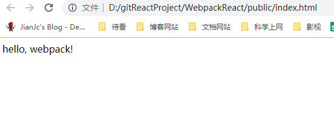
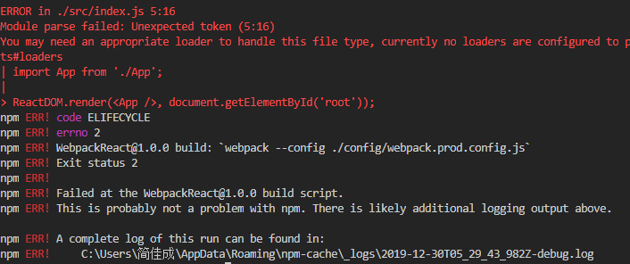
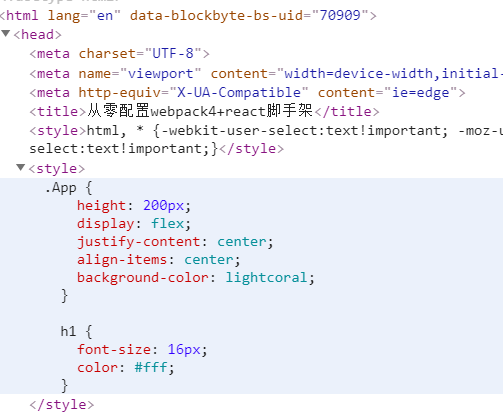
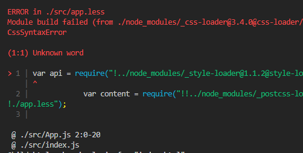

> 之前一直用官方的脚手架来创建react应用，用eject指令后查看weback的一些配置后发现就是基于webpack的多层优化，但里面用到的东西太多也比较杂，每次都不知道自己的react应用到底用了哪些技术栈，所以打算自己从零搭建一个类似于官方的脚手架，方便个性化处理
> 
## 项目的地址

https://github.com/jianjiachenghub/WebpackReact.git 

内部配置大部分做了详细说明 

执行方式： 

- 下载依赖：cnpm install
- 本地运行：cnpm run start
- 打包：cnpm run build

## 完成的功能

- [x] 分离生产环境与开发环境
- [x] 添加source-map方便调试
- [x] 分析了babel-polyfill不同导入方式的影响
- [x] 代码分割 定义了被抽离的模块如何分成组
- [x] 识别React语法以及ES6
- [x] 处理了不兼容ES7修饰器（@）Decorator的问题
- [x] 小于8k的图片以base64压入url减少请求
- [x] 添加了组件按需加载而不是直接导入整个模块
- [x] 加入了less以及sass的处理
- [x] 抽离了所有的css样式文件
- [x] 压缩了JS代码以及CSS代码
- [x] 添加了CSS自动补全浏览器前缀，增强了适配性
- [x] 完成对字体、图片、媒体文件的按大小分类打包策略
- [x] 生成一个HTML文件，并主动加入JS文件
- [x] 配置删除生产环境的console.log
- [x] 每次打包先清除dist目录
- [x] 加入了代码的热更新，修改代码自动编译 
- [x] 加入了webpack多入口的配置
- [x] 加入了对包大小的可视化分析工具

## 还想实现的功能

- babel缓存
我们每次执行构建都会把所有的文件都重复编译一遍，这样的重复工作是否可以被缓存下来呢，答案是可以的，目前大部分 loader 都提供了cache 配置项。比如在 babel-loader 中，可以通过设置cacheDirectory 来开启缓存，babel-loader?cacheDirectory=true 就会将每次的编译结果写进硬盘文件（默认是在项目根目录下的node_modules/.cache/babel-loader目录内，当然你也可以自定义）


- 使用动态链接库文件DLL
如果不使用使用 DLLPlugin 插件，当引入第三方模块时，每一次打包都要进行分析，是消耗打包的性能的。使用 DLLPlugin 提高打包速度,在第一次打包时，把第三方模块单独打包生成一个文件 vendors.dll.js ，之后在打包时就可以直接从 vendors.dll.js 中引入之前打包好的第三方模块，速度就会变快。
要想实现，就得做一些配置：
先配置 webpack.dll.js 文件，在 package.json中添加一个脚本，在配置 webpack.common.js 文件

- Tree Shaking按需加载:只支持 ES Module 例如 import 和 export 的静态结构特性的引入。当引入一个模块时，不引入所有的代码，只引入需要的代码。
- happypack并发执行任务(代码中加入未开启)

- CDN(已添加方法到笔记)
- 组件库按需加载babel-plugin-import(已加入未开启)
- 首屏渲染loading(方法已添加到笔记)


## 初始化package.json

创建一个WebpackReact项目，使用`cnpm init -y`指令
-y： 避免一直确认输入yes

## 安装 webpack 和 webpack-cli 到开发环境

`npm install --save-dev webpack webpack-cli`

## 创建一个公共打包的配置

创建一个公共打包的配置文件名为 `webpack.common.config.js`
```
WebpackReact
├── config
│   ├── webpack.common.config.js
```

```
const path = require('path');

module.exports = {
  entry: {
    app: './src/app.js',
  },
  output: {
    filename: 'js/bundle.js',
    path: path.resolve(__dirname, '../dist')
  }
}
```

## 创建一个文件夹名为 src ，在其中新建一个js文件名为 app.js

写入`console.log('hello world')`

```
WebpackReact
├── src
│   ├── app.js
```

## 修改package.json指令

```
  "scripts": {
    "test": "echo \"Error: no test specified\" && exit 1",
+  "start": "webpack --config ./config/webpack.common.config.js"
  },

```

## 初次打包

`npm run start`
在dist/js ，其中有一个js文件： `bundle.js`

```
!(function(e) {
  var t = {};
  function n(r) {
    if (t[r]) return t[r].exports;
    var o = (t[r] = { i: r, l: !1, exports: {} });
    return e[r].call(o.exports, o, o.exports, n), (o.l = !0), o.exports;
  }
  (n.m = e),
    (n.c = t),
    (n.d = function(e, t, r) {
      n.o(e, t) || Object.defineProperty(e, t, { enumerable: !0, get: r });
    }),
    (n.r = function(e) {
      "undefined" != typeof Symbol &&
        Symbol.toStringTag &&
        Object.defineProperty(e, Symbol.toStringTag, { value: "Module" }),
        Object.defineProperty(e, "__esModule", { value: !0 });
    }),
    (n.t = function(e, t) {
      if ((1 & t && (e = n(e)), 8 & t)) return e;
      if (4 & t && "object" == typeof e && e && e.__esModule) return e;
      var r = Object.create(null);
      if (
        (n.r(r),
        Object.defineProperty(r, "default", { enumerable: !0, value: e }),
        2 & t && "string" != typeof e)
      )
        for (var o in e)
          n.d(
            r,
            o,
            function(t) {
              return e[t];
            }.bind(null, o)
          );
      return r;
    }),
    (n.n = function(e) {
      var t =
        e && e.__esModule
          ? function() {
              return e.default;
            }
          : function() {
              return e;
            };
      return n.d(t, "a", t), t;
    }),
    (n.o = function(e, t) {
      return Object.prototype.hasOwnProperty.call(e, t);
    }),
    (n.p = ""),
    n((n.s = 0));
})([
  function(e, t) {
    console.log('hello world');// 在这里可以看到我们的代码
  }
]);

```

## 区分生产环境和开发环境

我们需要一个公共的配置，然后基于这个公共的配置上，生成生产环境的配置和开发环境的配置

`npm install --save-dev webpack-merge`

```
WebpackReact-----------------------------------根目录
├── config
│   ├── webpack.common.config.js---------------公共的配置
│   ├── webpack.dev.config.js------------------生产环境的配置
│   └── webpack.prod.config.js-----------------开发环境的配置
```

在生产环境`webpack.prod.config.js`就可以这样使用`merge`
```
const merge = require('webpack-merge');
const common = require('./webpack.common.config.js');

module.exports = merge(common, {
  mode: 'production',
});

```

然后修改`package.json`文件，添加指令

```
  "scripts": {
    "test": "echo \"Error: no test specified\" && exit 1",
-   "start": "webpack --config ./config/webpack.common.config.js",
+   "build": "webpack --config ./config/webpack.prod.config.js"
  },
```


修改`app.js`代码：

```

var root =document.getElementById('root');
root.innerHTML = 'hello, webpack!';
```

运行代码`npm run build`就可以看到dist文件下打包的js

## 测试打包结果

我们创建一个`public`来测试打包运行的结果，后面会用插件来干这件事

```
WebpackReact
├── config
│   ├── webpack.common.config.js
│   ├── webpack.dev.config.js
│   └── webpack.prod.config.js
├── dist
├── package.json
├── public
│   └── index.html ------------------创建来测试打包的JS是否可用
├── readme.md
├── src
│   ├── app.js
```

在`public`里创建一个html并引入打包好的JS文件

```
<!DOCTYPE html>
<html lang="en">
<head>
  <meta charset="UTF-8">
  <meta name="viewport" content="width=device-width, initial-scale=1.0">
  <meta http-equiv="X-UA-Compatible" content="ie=edge">
  <title>搭建Webpack4+React脚手架</title>
</head>
<body>
  <div id="root"></div>
  <script src="../dist/js/bundle.js"></script>
</body>
</html>

```

直接在浏览器里运行这个文件




## 安装react

```

npm install --save react react-dom

```

在 src 文件夹下新建一个js文件， index.js ，用于渲染根组件。
```
WebpackReact
├── config
│   ├── webpack.common.config.js
│   ├── webpack.dev.config.js
│   └── webpack.prod.config.js
├── dist
├── package.json
├── public
│   └── index.html ------------------创建来测试打包的JS是否可用
├── readme.md
├── src
│   ├── app.js
+   |——index.js
```

```

import React from 'react';
import ReactDOM from 'react-dom';
import App from './App';

ReactDOM.render(<App />, document.getElementById('root'));

```
并用jsx语法重写 app.js ：

```
import React from 'react';

function App() {
  return (
    <div className="App">Hello World</div>
  );
}

export default App;
```

修改webpack入口文件配置

```
  const path = require('path');

  module.exports = {
    entry: {
     index: './src/index.js',
    },
    output: {
      filename: 'js/bundle.js',
      path: path.resolve(__dirname, '../dist')
    }
  }

```

直接重新运行`npm run build` ，会发现打包失败，原因是webpack无法识别你的react语法啊，需要预先编译 



## 配置bable 

安装相关的bable依赖 

```
npm install --save-dev babel-loader @babel/preset-react @babel/preset-env @babel/core

```

*   **babel-loader** 使用Babel和webpack来转译JavaScript文件。
*   **@babel/preset-react** 转译react的JSX
*   **@babel/preset-env** 转译ES2015+的语法
*   **@babel/core** babel的核心模块

根目录新建一个配置文件`.babelrc` 配置相关的"presets"

```
{
    "presets": [// presets 就是 plugins 的组合
      [
        "@babel/preset-env",
        {
          "targets": {
            // 大于相关浏览器版本无需用到 preset-env
            "edge": 17,
            "firefox": 60,
            "chrome": 67,
            "safari": 11.1
          },
          // 根据代码逻辑中用到的 ES6+语法进行方法的导入，而不是全部导入
          "useBuiltIns": "usage" //useBuiltIns就是是否开启自动支持 polyfill，它能自动给每个文件添加其需要的poly-fill。
        }
      ],
      "@babel/preset-react"
    ],
    "plugins": [
      ["@babel/plugin-proposal-decorators", { "legacy": true }]// 转义ES7的修饰器@
    ]
  }
```

再修改`webpack.common.config.js` ，添加如下代码：
```
const path = require('path');

module.exports = {
  entry: {
    index: './src/index.js',
  },
  output: {
    filename: 'js/bundle.js',
    path: path.resolve(__dirname, '../dist')
  },
  module: {
    rules: [
      {
        test: /\.(js|jsx)$/,
        use: 'babel-loader',
        exclude: /node_modules/,//不需要去转译"node\_modules"这里面的文件。模块发布到npm时都要提供源码以及编译后的commonjs规范的代码
      }
    ]
  }
}

```
现在重新打包应该能成功了，别且运行我们手动创建的HTML文件能看到一个hello world

## 自动编译html并引入js文件
### html-webpack-plugin

`html-webpack-plugin`用来生成HTML文件自动引用打包好的JS文件
```
npm install --save-dev html-webpack-plugin

```

```
const merge = require('webpack-merge');
const common = require('./webpack.common.config.js');

const HtmlWebpackPlugin = require('html-webpack-plugin');

module.exports = merge(common, {
  mode: 'production',
  plugins: [
    new HtmlWebpackPlugin({
      filename: 'index.html',
      template: 'public/index.html',// 定义的html为模板生成 从根路径开始查找
      inject: 'body',
      minify: {// 压缩HTML文件
        removeComments: true,//去除注释
        collapseWhitespace: true,//去除空格
      },
    }),
  ]
});

```

## CSS跑起来
在我们的`/src` 目录下，新建一个文件名为`app.css` ，并输入以下代码：
```
.App {
  height: 200px;
  display: flex;
  justify-content: center;
  align-items: center;
  background-color: lightcoral;
}

h1 {
  font-size: 16px;
  color: #fff;
}

```

在app.js中引入css
```
import  './app.css';
```
配置loader
wbpack只能编译js文件，css文件是无法被识别并编译的，我们需要loader加载器来进行预处理。 首先安装`style-loader` 和`css-loader` ：
```
npm install --save-dev style-loader css-loader  

```
在module的rules里添加配置
```
      {
        test: /\.css$/,
        use: [ 
           
          'style-loader',// 最后计算完的css，将会使用style-loader生成一个内容为最终解析完的css代码的style标签，放到head标签里
          'css-loader' // css-loader加载器去解析这个文件，遇到“@import”等语句就将相应样式文件引入
        ]
      } 
```
可以看到CSS已经内嵌到了我们页面，我们可以优化一下让它单独提出来，下一章会详细说明


## 注意 

css编译器顺序可能会导致了Webpack编译报错 

 

Webpack选择了compose方式，而不是pipe的方式而已,从右往左的函数式，所以loader的顺序编程了从右往左 

```
const compose = (...fns) => x => fns.reduceRight((v, f) => f(v), x);
const add1 = n => n + 1; //加1
const double = n => n * 2; // 乘2
const add1ThenDouble = compose(
  double,
  add1
);
add1ThenDouble(2); // 6
// ((2 + 1 = 3) * 2 = 6) 
```
因为执行顺序必须是（先用加载器解析，再最终解析到style标签）css-loader->style-loader->
所以style-loader放在css-loader的左边，也就是上面

## 现在的目录结构
```
WebpackReact
├── config
│   ├── webpack.common.config.js ------------------------公共的配置
│   ├── webpack.dev.config.js ---------------------------开发环境配置（还未配置）
│   └── webpack.prod.config.js -------------------------生产环境配置
├── dist -----------------------------------------------打包的文件
├── package.json ---------------------------------------配置文件
├── public 
│   └── index.html -------------------------------------手动创建的入口后面会用插件打入包里
├── readme.md ------------------------------------------说明文档
├── src
│   ├── app.js ----------------------------------------组件
│   ├── app.css --------------------------------------样式文件
│   └── index.js --------------------------------------入口文件
```
下次会在这个目录的基础上加上less，sass解析以及字体、图片、多媒体文件的打包，并且加上代码的分割，提取公共代码等

## 需要用到的Webpack内置的配置

### 给打包出的js文件换个不确定名字
使用webpack内置的[hash]或[chunkhash]
```
const merge = require('webpack-merge');
const common = require('./webpack.common.config.js');
module.exports = merge(common, {
  mode: 'production',
  output: {
    filename: 'js/[name].[chunkhash:8].bundle.js',
  },
 ······
});

```

### 代码分割
Webpack内置了optimization（优化字段）的splitChunks来实现代码的分割，大多数情况下不需要配置就够用了，但你也可以个性化的配置，
比如你想指定哪些代码该分到哪一组可以使用cacheGroups来配置
```
module.exports = {
  //...
  optimization: {
    splitChunks: {// 抽离公共代码 具体配置看官网
      chunks: 'all',// 效值是all、async和initial。提供all可能特别强大，因为这意味着即使在异步和非异步块之间也可以共享块
      minSize: 30000,
      maxSize: 0,
      minChunks: 1,
      cacheGroups: {// 定义了被抽离的模块如何分成组，不然公共代码全打包到一个JS文件里面
        vendors: {// 第三方库抽离
          priority: 1,// 权重 先进行第三方库抽离
          test:  /[\\/]node_modules[\\/]/,// 选从node_modules文件夹下引入的模块，所以所有第三方模块才会被拆分出来 递归的
          name: "vendor",
          enforce: true,
        },
      }
    }
  //...
};

```

## 自动编译打包
### 安装webpack-dev-server
```
npm install webpack-dev-server --save-dev
```
### 增加代码至`webpack.dev.config.js` ：
```
const path = require('path');
const merge = require('webpack-merge');
const common = require('./webpack.common.config.js');

const webpack = require('webpack');
const HtmlWebpackPlugin = require('html-webpack-plugin');

module.exports = merge(common, {
  mode: 'development',
  output: {
    filename: 'js/[name].[hash:8].bundle.js',
  },
  devServer: {
    contentBase: path.resolve(__dirname, '../dist'),
    open: true,
    port: 9000,
    compress: true,
    hot: true
  },
  plugins: [
    new HtmlWebpackPlugin({
      template: 'public/index.html',
      inject: 'body',
      hash: false
    }),
    new webpack.HotModuleReplacementPlugin()
  ]
});

```
`HotModuleReplacementPlugin`是webpack热更新的插件，设置`devServer.hot`为true，并且在plugins中引入HotModuleReplacementPlugin插件即可。  
**注意的是我们开启了hot，那么导出不能使用chunkhash，需要替换为hash。**

### 修改我们的package.json
```
  "scripts": {
    "test": "echo \"Error: no test specified\" && exit 1",
    "build": "webpack --config ./config/webpack.prod.config.js",
+   "start": "webpack-dev-server --inline --config ./config/webpack.dev.config.js"
  },


```

### 修改代码自动运行
执行代码
```
npm run start
```
自动开了一个端口为9000的网页，上面是我们写的页面内容，这和我们的配置都是一一对应的。  
现在你随意修改app.js中的代码，再回到页面看下是不是也跟着变了，那我们就整合webpack-dev-server成功！


## 其他需要用到的插件简介


### terser-webpack-plugin
可配置删除console.log
```
npm install --save-dev terser-webpack-plugin
```

### clean-webpack-plugin
只想要最新打包编译的文件，就需要先清除dist目录

```
npm install --save-dev clean-webpack-plugin
```

### uglifyjs-webpack-plugin
压缩代码
```
npm install --save-dev uglifyjs-webpack-plugin
```

### mini-css-extract-plugin
将css提出去，而不是直接在页面来内嵌
```
npm install --save-dev mini-css-extract-plugin
```

### webpack-bundle-analyzer
可视化的包大小分析工具
```
npm install --save-dev webpack-bundle-analyzer
```


stat: 12.06M (打包之前输入的文件大小)

parsed: 5.51M（打包之后输出的文件大小）

gzipped: 1.68M（开启gzip压缩后的文件大小）
## 其他优化打包的插件使用方式
直接在plugins字段里面new一个实例，参数就是插件的配置项
我就不一一介绍了直接给一个完整的webpack.prod.config配置
```
const merge = require('webpack-merge'); // 区分生产环境和开发环境
const common = require('./webpack.common.config.js'); // 导入基础配置
const HtmlWebpackPlugin = require('html-webpack-plugin'); // 插件为你生成一个HTML文件，并主动加入JS文件
const TerserPlugin = require('terser-webpack-plugin');// 可配置删除console.log
const {CleanWebpackPlugin} = require('clean-webpack-plugin');// 只想要最新打包编译的文件，就需要先清除dist目录
const UglifyJsPlugin = require('uglifyjs-webpack-plugin');// 压缩代码
const MiniCssExtractPlugin = require('mini-css-extract-plugin');// 将css提出去，而不是直接在页面来内嵌
const OptimizeCssAssetsPlugin = require('optimize-css-assets-webpack-plugin');// 将提出去的css压缩
const BundleAnalyzerPlugin = require('webpack-bundle-analyzer').BundleAnalyzerPlugin; // 包大小分析工具

module.exports = merge(common, {
  mode: 'production',
  output: {
    filename: 'js/[name].[chunkhash:8].bundle.js',
  },
  module: {
    rules: [
      {
        test: /\.css$/,
        use: [ 
          MiniCssExtractPlugin.loader,// 单独提出CSS
          'css-loader',
          'postcss-loader'// 对css编译的工具 可以：1.使用下一代css语法 2 . 自动补全浏览器前缀 3 . 自动把px代为转换成rem 
        ]
      },
      {
        test: /\.less$/,
        use: [
          MiniCssExtractPlugin.loader,
          'css-loader',
          'postcss-loader',
          'less-loader'
        ]
      },
      {
        test: /\.(scss|sass)$/,
        use: [
          MiniCssExtractPlugin.loader,
          'css-loader',
          'postcss-loader',
          'sass-loader'
        ]
      },
    ]
  },
  plugins: [
    new HtmlWebpackPlugin({
      filename: 'index.html',
      template: 'public/index.html',// 定义的html为模板生成 从根路径开始查找
      inject: 'body',
      minify: {// 压缩HTML文件
        removeComments: true,//去除注释
        collapseWhitespace: true,//去除空格
      },
    }),
    new CleanWebpackPlugin(),
    new UglifyJsPlugin(),
    new MiniCssExtractPlugin({
      filename: 'css/[name].[hash].css',
      chunkFilename: 'css/[id].[hash].css',
    }),
    new BundleAnalyzerPlugin({
      analyzerPort: 9001,
    })
  ],
  optimization: {// 优化
    minimizer: [ // 最小化器
      new TerserPlugin({// 缩减代码的插件
        terserOptions: {
          compress: {
            drop_console: true, // 删除console.log
          },
        }
      }),
      new OptimizeCssAssetsPlugin({// 压缩CSS
        assetNameRegExp:/\.css$/g,
        cssProcessor:require("cssnano"),// 用于压缩和优化CSS 的处理器
        cssProcessorPluginOptions:{
          preset:['default', { discardComments: { removeAll:true } }]
        },
        canPrint:true
      })
    ],
    splitChunks: {// 抽离公共代码 具体配置看官网
      chunks: 'all',// 效值是all、async和initial。提供all可能特别强大，因为这意味着即使在异步和非异步块之间也可以共享块
      minSize: 30000,
      maxSize: 0,
      minChunks: 1,
      cacheGroups: {// 定义了被抽离的模块如何分成组，不然公共代码全打包到一个JS文件里面
        vendors: {// 第三方库抽离
          priority: 1,// 权重 先进行第三方库抽离
          test:  /[\\/]node_modules[\\/]/,// 选从node_modules文件夹下引入的模块，所以所有第三方模块才会被拆分出来 递归的
          name: "vendor",
          enforce: true,
        },
      }
    }
  }
});
```

## 打包图片字体媒体文件，以及调试优化
下载文件打包的依赖
```
npm install file-loader url-loader --save-dev

```
调试devtool里填个cheap-module-eval-source-map，当你保存时能直接找到源文件的多少在报错

下面直接给个一个给个webpack.common.config的配置
```
const path = require("path");

module.exports = {
  devtool: "cheap-module-eval-source-map",// 方便调试
  entry: {
    // 定义入口文件
    index: "./src/index.js"
    //index: ['babel-polyfill','./src/index.js'], // 添加polyfill垫片（挂载ES6+的方法和API如Promise等）这是很老的写法被坑了，会污染全局，现在preset-env内置了按需加载
    //framework: ['react','react-dom'],// 代码分割 定义分组
  },
  output: {
    // 编译打包之后的文件名以及所在路径
    filename: "js/bundle.js",
    path: path.resolve(__dirname, "../dist")
  },
  module: {
    // 编译器
    //noPars:/jquery/,// 比如我引入了jquery 它不依赖其他的包，就不需要解析 直接打包
    rules: [
      {
        test: /\.(js|jsx)$/, // 代码
        use: "babel-loader",
        exclude: /node_modules/ // 不需要去转译
      },
      {
        test: /\.(jpg|png|gif)$/, //图片
        use: {
          loader: "url-loader",
          options: {
            name: "[name].[ext]",
            outputPath: "images/",
            limit: 8192 // 大于8Kb走file-loader（好像是自动的不用添加fallback），小的ICON什么的直接打包插入到bundle.js中减少Http请求
            /*             fallback: {
              loader: 'file-loader',
              options: {
                  name: 'img/[name].[hash:8].[ext]'
              } */
          }
        }
      },
      {
        test: /\.(eot|ttf|svg|woff|woff2)$/, // 字体
        use: {
          loader: "file-loader",
          options: {
            name: "[name]_[hash].[ext]",
            outputPath: "font/"
          }
        }
      },
      {
        test: /\.(mp4|webm|ogg|mp3|wav|flac|aac)(\?.*)?$/, //媒体文件
        use: {
          loader: "file-loader",
          options: {
            name: "[name].[hash:8].[ext]",
            outputPath: "media/"
          }
        }
      },
 /*      {
        test: /\.css$/,
        use: [ 
           
          'style-loader',// 最后计算完的css，将会使用style-loader生成一个内容为最终解析完的css代码的style标签，放到head标签里
          'css-loader' // css-loader加载器去解析这个文件，遇到“@import”等语句就将相应样式文件引入
        ]
      } */
    ]
  }
};

```
## 完整的目录结构
```
WebpackReact
├── config
│   ├── webpack.common.config.js
│   ├── webpack.dev.config.js
│   ├── webpack.multipleEntry.config.js
│   └── webpack.prod.config.js
├── dist
├── dist备份
│   └── 第一次打包.js
├── font
│   ├── demo.css
│   ├── demo_index.html
│   ├── iconfont.css
│   ├── iconfont.eot
│   ├── iconfont.js
│   ├── iconfont.json
│   ├── iconfont.svg
│   ├── iconfont.ttf
│   ├── iconfont.woff
│   └── iconfont.woff2
├── image
│   ├── vscode.png
│   ├── 可视化.png
│   ├── 快餐.png
│   ├── 美食.png
│   └── 面包.png
├── package.json
├── postcss.config.js
├── public
│   └── index.html
├── readme.md
├── src
│   ├── app.js
│   ├── app.less
│   └── index.js
├── video
│   └── 110.mp4
└── 笔记.md
```


## 参考文章
- https://webpack.js.org/guides/build-performance/#avoid-production-specific-tooling
- https://www.babeljs.cn/
- https://segmentfault.com/n/1330000021445674
- https://juejin.im/post/5aa3d2056fb9a028c36868aa
- https://juejin.im/post/5bf61082f265da616a474b5c#heading-22