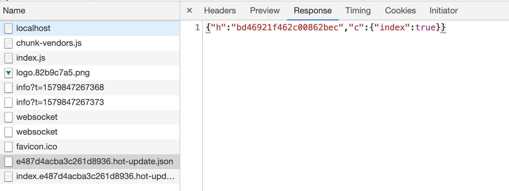
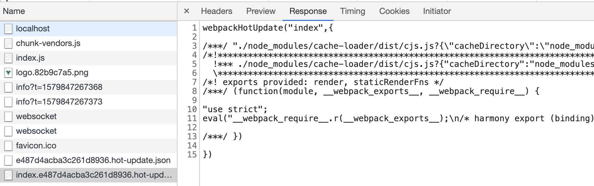

## 热更新
首先介绍一下 Live reloading 和 Hot reloading 的区别：

- Live reloading: 修改文件之后，Webpack 重新编译，并强制刷新浏览器，属于全局（整个应用）刷新，相当于 window.location.reload()；
- Hot reloading: 修改文件之后，Webpack 重新编译对应模块，刷新时可以记住应用的状态，从而做到局部刷新。

Hot Module Replacement（HMR）特性最早由 webpack 提供，能够对运行时的 JavaScript 模块进行热更新（无需重刷，即可替换、新增、删除模块）

与整个重刷相比，模块级热更新最大的意义在于能够保留应用程序的当前运行时状态，让更加高效的Hot Reloading开发模式成为了可能
http://www.ayqy.net/blog/hot-module-replacement/

## Webpack 热更新(HMR)原理

>https://juejin.im/post/5de0cfe46fb9a071665d3df0
>https://juejin.im/post/5d8b755fe51d45781332e919
>https://www.mybj123.com/4764.html

主要依赖webpack, express, websocket

- 使用express启动本地服务，这个服务端可以监听本地文件的变化，当浏览器访问的时候做出响应
- 服务端和客户端使用websocket实现长连接建立通信
- webpack监听源文件的变化
  - 每次编译完成之后会生成hash值，已改动模块的json文件，已改动模块代码的js文件
  - 编译完成后本地服务端通过socket向客户端推送当前编译的hash值
- 客户端的websocket监听到有文件改动推送过来的hash值，会和上一次进行对比
  - 一致就走缓存
  - 不一致则通过ajax和jsonp获取最新的资源
- 使用内存文件系统去替换有修改的内容实现局部更新


### 监听webpack编译结束

```
// node_modules/webpack-dev-server/lib/Server.js
// 绑定监听事件
setupHooks() {
    const {done} = compiler.hooks;
    // 监听webpack的done钩子，tapable提供的监听方法
    done.tap('webpack-dev-server', (stats) => {
        this._sendStats(this.sockets, this.getStats(stats));
        this._stats = stats;
    });
};
// 通过websoket给客户端发消息
_sendStats() {
    this.sockWrite(sockets, 'hash', stats.hash);
    this.sockWrite(sockets, 'ok');
}
```

###  webpack监听文件变化

每次修改代码，就会触发编译。说明我们还需要监听本地代码的变化，主要是通过setupDevMiddleware方法实现的。
```
// node_modules/webpack-dev-middleware/index.js
compiler.watch(options.watchOptions, (err) => {
    if (err) { /*错误处理*/ }
});

// 通过“memory-fs”库将打包后的文件写入内存
setFs(context, compiler); 

```

- 首先对本地文件代码进行编译打包，也就是webpack的一系列编译流程。
- 其次编译结束后，开启对本地文件的监听，当文件发生变化，重新编译，编译完成之后继续监听。

为什么代码的改动保存会自动编译，重新打包？这一系列的重新检测编译就归功于compiler.watch这个方法了。监听本地文件的变化主要是通过文件的生成时间是否有变化，这里就不细讲了。

**注意：执行setFs方法，这个方法主要目的就是将编译后的文件打包到内存。而不是你的dist目录，因为运行时内存效率更高**

### 客户端从新拉取资源

```
// webpack-dev-server/client/index.js
var socket = require('./socket');
var onSocketMessage = {
    hash: function hash(_hash) {
        // 更新currentHash值
        status.currentHash = _hash;
    },
    ok: function ok() {
        sendMessage('Ok');
        // 进行更新检查等操作
        reloadApp(options, status);
    },
};
// 连接服务地址socketUrl，?http://localhost:8080，本地服务地址
socket(socketUrl, onSocketMessage);

function reloadApp() {
	if (hot) {
        log.info('[WDS] App hot update...');
        
        // hotEmitter其实就是EventEmitter的实例
        var hotEmitter = require('webpack/hot/emitter');
        hotEmitter.emit('webpackHotUpdate', currentHash);
    } 
}

hotEmitter.on('webpackHotUpdate',()=>{
	if(!hotCurrentHash || hotCurrentHash == currentHash){
		return hotCurrentHash = currentHash
	} 
	hotCheck()
})
```

- hotCheck 会通过ajax请求服务端拉取最新的 hot-update.json 描述文件 说明哪些模块哪些chunk（大集合）发生了更新改变

- 然后根据描述文件 hotDownloadUpdateChunk 去创建jsonp拉取到最新的更新后的代码,返回形式为： webpackHotUpdate(id, {...})
  
- 为了拉取到的代码直接执行，客户端需要定义一个 window.webpackHotUpdate 函数来处理
这里面将缓存的旧代码更新为最新的代码，接着将父模块中的render函数执行一下
- 最后将 hotCurrentHash = currentHash 置旧hash方便下次比较

## React fast refresh

> http://www.ayqy.net/blog/fast-refresh-under-the-hood/

要想达到比HMR（module 级）、React Hot Loader（受限的组件级）粒度更细的热更新能力，支持组件级、甚至 Hooks 级的可靠更新，仅靠外部机制（补充的运行时、编译转换）很难做到，需要 React 的深度配合

也就是说，一些之前绕不过去的难题（比如 Hooks），现在可通过 React 配合解决

实现上，Fast Refresh 同样基于 HMR，自底向上依次为：

- HMR 机制：如 webpack HMR
- 编译转换：react-refresh/babel
- 补充运行时：react-refresh/runtime
- React 支持：React DOM 16.9+，或 react-reconciler 0.21.0+

fast Refresh 功能最大的特性是：
- 开发环境下，可以保持组件状态，同时编辑提供即时反馈。
- 官方的支持，除了光环之外，还带来性能与稳定性保障，对 hook 更完善的支持

然而，有些情况下，维持状态并不十分安全，所以可靠起见，Fast Refresh 遇到这些情况一概不保留状态：

- Class 组件一律重刷（remount），state 会被重置，包括高阶组件返回的 Class 组件
- 不纯组件模块，所编辑的模块除导出 React 组件外，还导出了其它东西
